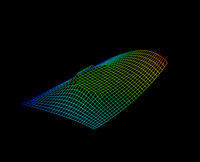

Minimal Surface Problem
-----------------------

In this example it is shown how the gradient of the function

.. literalinclude:: minimal_surface.py
   :lines: 4-8
    
can be computed conveniently using ALGOPY. It is the objective function of a minimal surface problem.
With boundary constraints and an additional constraint in the domain in form of a cylinder one obtains
a plot like

    
At first the initial values are specified and the function evaluation is traced

.. literalinclude:: minimal_surface.py
   :lines: 12-27

One can now compute the gradient of the objective function as follows

.. literalinclude:: minimal_surface.py
   :lines: 30-41
    

   
The complete code is

.. literalinclude:: minimal_surface.py
   :lines: 1-

    
