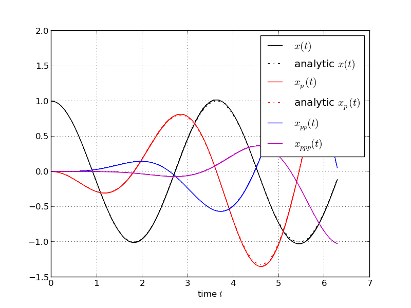

Differentiation of ODE Solutions
================================

It is very easy to use AD techniques to obtain derivatives of the form :math:`\frac{d x(t)}{d p}`,
where :math:`x(t) \equiv x(t; x_0, p) \in \mathbb R^{N_x}` is solution of the ordinary differential equation

.. math::
    \dot x(t) = f(t, x, p) \\
      x(0) = x_0(p) \;,
      
where the initial values :math:`x(0)` is a function :math:`x_0(p)` depending on
some parameter :math:`p \in \mathbb R^{N_p}`.

Consider the following code that computes  :math:`\frac{d x(t)}{d p}` of the 
harmonic oscillator described by the ODE

.. math::
    \dot x(t) = \begin{pmatrix} x_2 \\ -p  x_1 \end{pmatrix} \;.

    
Explict Euler:
~~~~~~~~~~~~~~
    
To illustrate the idea, we use the
explict Euler integration scheme.

.. literalinclude:: explicit_euler.py

Implicit Euler:
~~~~~~~~~~~~~~

Since in practice often implicit integration schemes (stiff ODEs) are necessary,
we illustrate the approach at the example of the implicit Euler integration scheme:

The ODE is discretized in time as

.. math::
    x_{k+1} - x_k = (t_{k+1} - t_k) f(t_{k+1}, x_{k+1}, p) \\
    0 = F(x_{k+1}, x_k, t_{k+1}, t_k, p) =  (t_{k+1} - t_k) f(t_{k+1}, x_{k+1}, p) - x_{k+1} + x_k
    
The task at hand is to solve this implicit function in UTP arithmetic, i.e. given
:math:`0 = F(x,y)`, where :math:`x` is input and  :math:`y` is output, solve 

.. math::
    0 = F([x]_D, [y]_D) \mod T^D \;.

There are several possibilities to achieve this goal. For instance one can first
solve the nominal problem :math:`0 = F(x,y)` then successively compute the higher-order
coefficients :math:`y_d, d=1,\dots,D-1`. To soution of the nominal problem can be
done by applying Newton's method, i.e. given an initial guess for :math:`y` compute
an update :math:`\delta y`, i.e. iterate

.. math::
   \delta y = - (F_x(x,y))^{-1} F(x,y) \\
   y = y + \delta y

Once :math:`y` is known one can find the higher-order coefficients by using Newton-Hensel lifting

.. math::
    y_d T^d = -(F_x(x,y))^{-1} F([y]_{d}, [x]_{d+1}) \mod T^{d+1} \;.
    
The complete procedure is shown in the following code:

.. literalinclude:: implicit_euler.py

The generated plot shows the numerically computed trajectory
and the analytically derived solutions.  One can see that the numerical trajectory
of :math:`\frac{d x(t)}{d p}` is close to the analytical solution. More elaborate
ODE integrators would yield better results.

.. image:: implicit_euler.png
    :align: center
    :scale: 100
