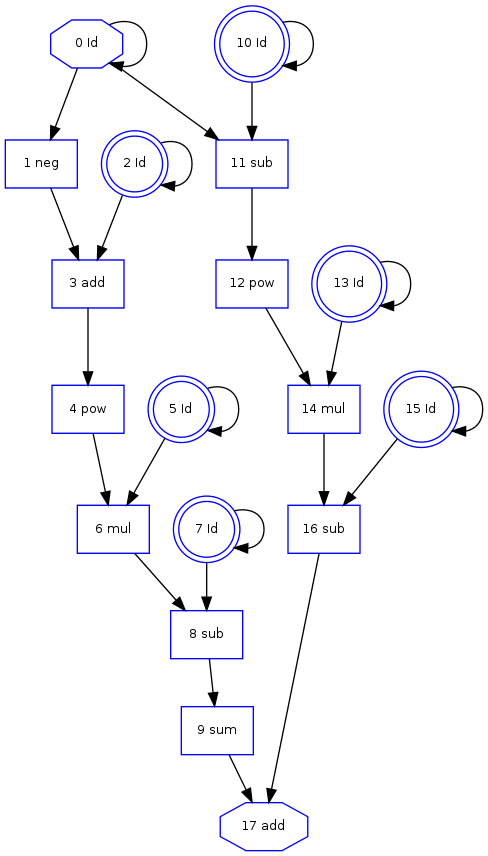

Posterior Log Probability
-------------------------

We want the derivative of a posterior log probability density calculation.
We have a normal distribution with known variance.

.. literalinclude:: posterior_log_probability.py
   :lines: 1-

as output one obtains::
    
    walter@wronski$ python examples/posterior_log_probability.py
    function evaluation =
    138.692022348
    function evaluation = 138.692022
    1st directional derivative = 44.061288
    2nd directional derivative = 94.000000
    finite differences derivative =
    44.0612893726
    gradient =  44.0612882911
    Hessian vector product =  94.0
    

and the computational graph:

