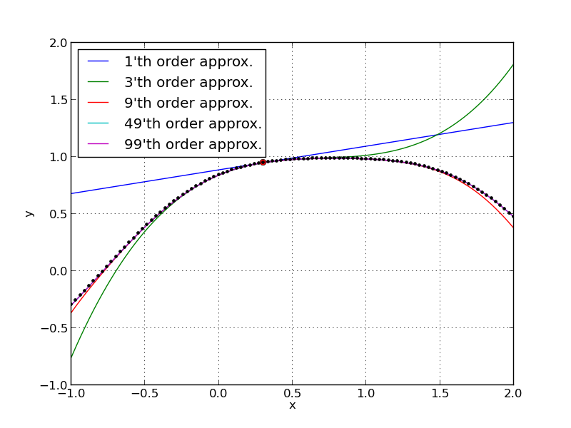

Univariate Taylor Series Expansions
-----------------------------------------------

As an easy example we want to compute the Taylor series expansion of

.. math::
    y = f(x) = \sin(\cos(x) + \sin(x))
    
about :math:`x_0 = 0.3`. The first thing to notice is that we can as well compute the
Taylor series expansion of

.. math::
    y = f(x_0 + t) = \sin(\cos(x_0 + t) + \sin(x_0 + t))
    
about :math:`t = 0`. Taylor's theorem yields

.. math::
    f(x_0 + t) &= \sum_{d=0}^{D-1} y_d t^d + R_{D}(t) \\
    \mbox{where } \quad y_d &= \left. \frac{1}{d!} \frac{d^d }{d t^d}f(x_0 + t) \right|_{t = 0} \;.
    
and :math:`R_D(x)` is the remainder term.

Slightly rewritten one has

.. math::
    y(t) = f(x(t)) + \mathcal O(t^D)
    
i.e., one has a polynomial :math:`x(t) = \sum_{d=0}^{D-1} x_d t^d` as input and
computes a polynomial :math:`y(t) = \sum_{d=0}^{D-1} y_d t^d + \mathcal O(t^d)` as output.

This is now formulated in a way that can be used with ALGOPY.
    
.. literalinclude:: series_expansion.py
    :lines: 0-13

Don't be confused by the P. It can be used to evaluate several Taylor series expansions
at once. The important point to notice is that the D in the code is the same D
as in the formula above. I.e., it is the number of coefficients in the polynomials.
The important point is

.. warning:: The coefficients of the univariate Taylor polynomial (UTP) are stored in
          the attribute UTPM.data. It is a x.ndarray with shape (D,P) + shape of the coefficient.
          In this example, the coefficients :math:`x_d` are scalars and thus x.data.shape = (D,P).
          However, if the the coefficients were vectors of size N, then x.data.shape would be (D,P,N), 
          and if the coefficients were matrices with shape (M,N), then x.data.shape would be (D,P,M,N).
          
          

To see that ALGOPY indeed computes the correct Taylor series expansion we plot
the original function and the Taylor polynomials evaluated at different orders.

.. literalinclude:: series_expansion.py
    :lines: 14-

    
    This plot shows Taylor approximations of different orders. 
    The point :math:`x_0 = 0.3` is plotted as a red dot and the original
    function is plotted as black dots. One can see that the higher the order,
    the better the approximation.
    
 
